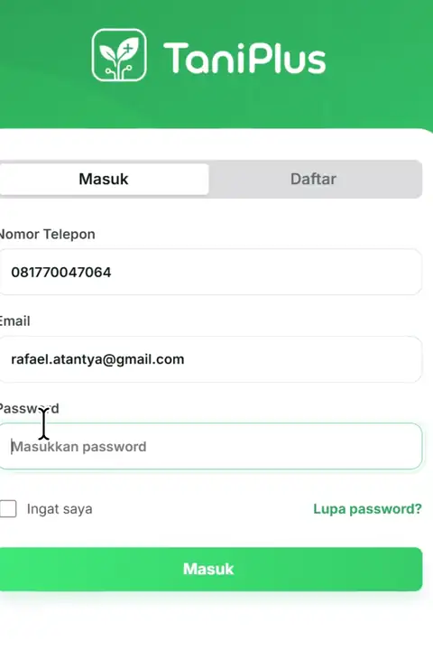

<p align="center">
  
</p>

<p align="center">
  <strong>Predictive insights. Real-time protection. Better decisions for every field.</strong>
</p>

<p align="center">
  <a href="https://taniplus.vercel.app">Live Demo</a>
  &nbsp;&middot;&nbsp;
  <a href="https://github.com/rafaelatantya/TaniPlus/actions/workflows/ci.yml">CI</a>
  &nbsp;&middot;&nbsp;
  <a href="#local-development">Local Setup</a>
</p>

<p align="center">
  
  
  
  
  
</p>

<p align="center">
  
</p>

<p align="center"><em>Monitor field conditions, inspect sensor details, and act on clear status insights.</em></p>

---

## Inspiration

> **What if a farmer could know exactly when their crops needed water before drought silently destroyed an entire harvest?**

For generations, Indonesian farmers have relied on experience, visual observation, and inherited knowledge to decide when to irrigate or fertilize. That knowledge remains invaluable, but an increasingly unpredictable climate makes every decision harder.

During prolonged dry seasons and El Niño events, a few days of delayed irrigation can mean heat stress, wasted inputs, declining yields, or complete crop failure. Precision-agriculture technology can help, yet many commercial systems remain too expensive and complex for smallholder farmers.

TaniPlus explores a more accessible path: combine affordable environmental sensing with a simple dashboard that turns field conditions into information farmers can understand and act on.

> **When every drop of water matters, every farming decision should be backed by data, not guesswork.**

## What Is TaniPlus?

TaniPlus is a mobile-first agricultural monitoring dashboard designed around IoT sensor boxes placed across farming areas. Instead of overwhelming users with raw numbers, the interface organizes each box into a clear condition:

| Condition | Meaning | Visual cue |
| --- | --- | --- |
| **Good** | Sensor score is above the healthy threshold | Green |
| **Needs maintenance** | The field requires attention | Red-orange |
| **Error** | The box is disconnected or reports abnormal data | Gray |

The dashboard presents water content, soil moisture, temperature, rainfall, crop age, soil pH, device information, and clear status summaries in one focused experience.

## Current Prototype

The deployed web prototype currently includes:

- Registration, login, persistent sessions, and logout
- Redis-backed user accounts with hashed passwords
- HTTP-only session cookies handled by Vercel Functions
- A dashboard containing good, maintenance, and error box states
- Stable, user-specific simulated sensor readings
- Detailed sensor and device-information pages
- Per-user box renaming stored locally in the browser
- A responsive interface based on the TaniPlus design system

Try it at **[taniplus.vercel.app](https://taniplus.vercel.app)**.

> [!NOTE]
> Sensor readings in the current web prototype are simulated deterministically for demonstration. Physical sensor ingestion and historical telemetry are part of the next implementation phase.

## How It Works

```text
User
  |
  v
React dashboard ---- localStorage (custom box names)
  |
  v
Vercel Function ---- Upstash Redis (users and sessions)
```

The current prototype deliberately keeps the data model lightweight:

- **Upstash Redis** stores user records and authenticated sessions.
- **Vercel Functions** validate credentials and manage secure cookies.
- **localStorage** stores renamed boxes separately for each user.
- **Predefined sensor boxes** provide consistent good, maintenance, and error scenarios.
- **Deterministic generation** gives every user a distinct but stable sensor dataset.

## Sensor Rules

The product concept follows these base sensor-box rules:

1. A score above `4` is considered good.
2. A score below `4` is considered poor and requires attention.
3. Error status is used when the sensor box cannot reach the server or sends abnormal outlier data.
4. A production sensor box is expected to synchronize every 10 minutes.

## Technology

| Layer | Technology |
| --- | --- |
| Interface | React 19, TypeScript, CSS |
| Build tooling | Vite 7 |
| Server API | Vercel Functions |
| Authentication store | Upstash Redis |
| Hosting | Vercel |
| Continuous integration | GitHub Actions |

## Local Development

### Requirements

- Node.js 22, or another version accepted by `package.json`
- Access to the connected Vercel project
- Access to the connected Upstash Redis database

### Installation

```bash
git clone https://github.com/rafaelatantya/TaniPlus.git
cd TaniPlus
npm ci
```

Link the repository to Vercel and pull its environment configuration:

```bash
npx vercel link
npx vercel env pull .env.local --environment=production
```

Required variables:

```env
KV_REST_API_URL=
KV_REST_API_TOKEN=
SESSION_SECRET=
DEFAULT_USER_PASSWORD=
```

Vercel may download sensitive integration values as `[SENSITIVE]`. If that happens, copy the actual Redis URL and token from the Upstash dashboard into `.env.local`.

Start the complete application, including its server functions:

```bash
npx vercel dev
```

Open **[localhost:3000](http://localhost:3000)**.

> [!IMPORTANT]
> `npm run dev` starts only the Vite frontend. Use `npx vercel dev` when testing registration, login, sessions, or logout.

### Scripts

| Command | Purpose |
| --- | --- |
| `npm run dev` | Start the frontend-only Vite server |
| `npm run build` | Type-check and build the production application |
| `npm run preview` | Preview a completed production build |

## Deployment

GitHub and Vercel are connected directly:

- Pushes to `main` create production deployments.
- Pull requests receive Vercel preview deployments.
- GitHub Actions runs a clean installation and production build.
- Deployment is left to Vercel, avoiding duplicate CI deployment jobs.

Never commit `.env.local`, Redis credentials, session secrets, or service-role credentials.

## Roadmap

- Connect physical ESP32-based sensor boxes through a secured ingestion API
- Store latest readings and historical telemetry per device
- Generate irrigation and heat-stress recommendations from agronomic thresholds
- Add weather and climate-data integrations
- Support shared sensor infrastructure through Gapoktan
- Validate the system through an agricultural field pilot

## Vision

TaniPlus is designed around a simple belief: advanced agricultural technology creates meaningful impact only when it is practical, affordable, and accessible.

The long-term goal is not merely to display sensor values. It is to help smallholder farmers conserve water, reduce avoidable crop loss, use agricultural inputs more efficiently, and build resilience against an increasingly uncertain climate.

> **Every field deserves the chance to thrive, and every farmer deserves the power of data.**
